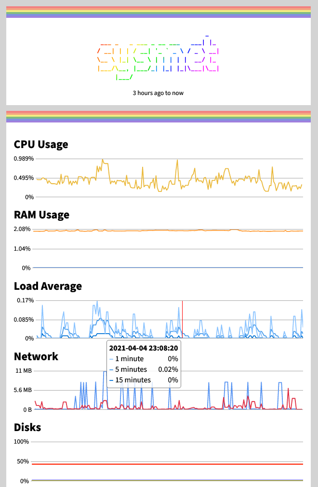

# [sysmet](https://unix.lgbt/~diamond/sysmet)



A no-JavaScript CGI-based lightweight system metrics collector and frontend,
effectively a very tiny version of the Grafana + Telegraf + InfluxDB stack.

## Usage

### sysmet-update

`sysmet-update` is the metrics collector for the database. It is meant to be
called every n duration, usually 15 seconds or a minute. It can only be called
every second.

Using `systemd-timers` or `crond` is recommended. Below is an example for `crond`:

```
sysmet-update -db /opt/sysmet/db
```

### sysmet-http

`sysmet-http` is the frontend daemon that serves the HTML pages on the given
listen address. It should be used like so:

```
sysmet-http -db /opt/sysmet/db 127.0.0.1:5000
```

Most use cases should involve another external web server like
[Caddy](caddyserver.com/) to provide HTTPS. In Caddy's case, its Caddyfile could
be as simple as this:

```
https://domain.com

reverse_proxy http://127.0.0.1:5000
```

### sysmet-cgi

`sysmet-cgi` is the CGI version of `sysmet-http`. Most people should not use
this.

## API Documentation

Refer to [pkg.go.dev][pkg.go.dev] as well as the [test suites][sysmet_test.go].

[pkg.go.dev]: https://pkg.go.dev/git.unix.lgbt/diamondburned/sysmet
[sysmet_test.go]: https://git.unix.lgbt/diamondburned/sysmet/src/branch/main/sysmet_test.go

## Note to Self

If I ever ponder about using BadgerDB over bbolt: don't, simply don't. Bbolt
allows concurrent read opens AND (!!!) waits until the exclusive writer is done
WITHOUT needing write permissions.
